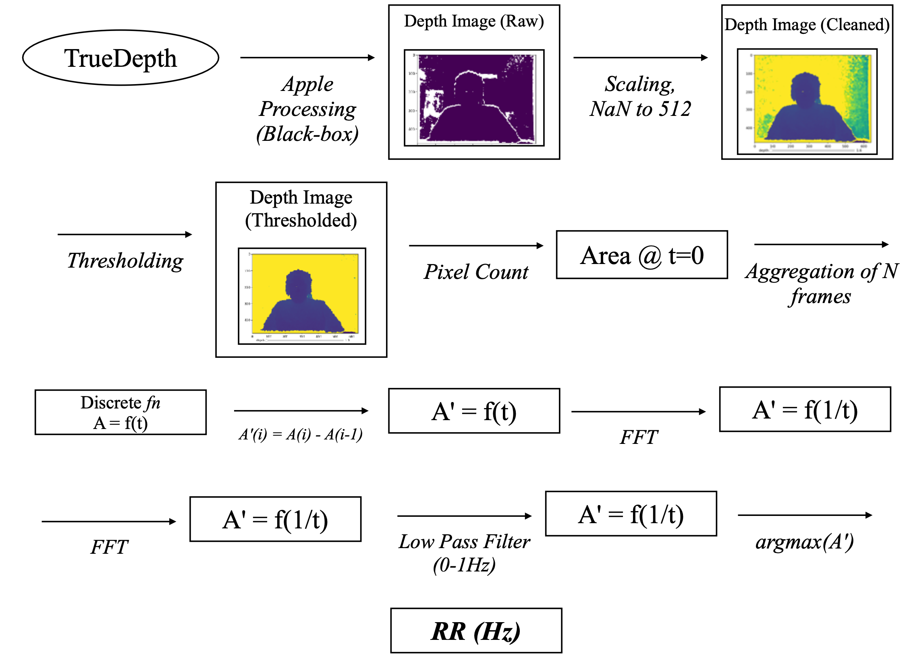

# 🗣️ TrueBreath: Respiratory Rate Measurement using the TrueDepth Camera

For a mobile & pervasive computing course paper. This app is a proof-of-concept
breathing rate measurement device using the TrueDepth cameras on iPhone X and
higher models.

## Architecture

## Components

There's an iOS app that has to be run on an iPhone that supports Face ID. It's
based on Apple's
[Streaming Depth Data from the TrueDepth Camera](https://developer.apple.com/documentation/avfoundation/additional_data_capture/streaming_depth_data_from_the_truedepth_camera)
code example, albeit with the point cloud component removed and the ability to
record a minute of data to be uploaded to a server component (under `server/`)
added. We fix the recording at 5 fps, which is still above the Nyquist
frequency for human breathing (2Hz.)

The server component is responsible for calculating the breathing rate. Writing
the calculation of the breathing rate to the phone in Swift is left as an
exercise to the reader.

Here's how to test the app:

1. Prop your phone up at about arm's length at neck height, in landscape mode
   (I propped it up against my monitor.)
1. Use a metronome such as the one at https://www.musicca.com/metronome; set the
   bpm to your target breathing rate * 2, then alternate breathing in and out
   with every beat.
1. Start the server in `server/simple_server.py`. Make sure your phone and Mac
   are connected to the same network.
1. Update the URLs in `TrueBreath/CameraViewController.swift` to target your
   computer, then build and run the app. Wait for the app to launch.
1. Take a few breaths, then tap record, maintaining the same breathing rate
1. Wait one minute, then the server should print your breathing rate to stdout

## Legal Stuff

Copyright © 2024 Mohamed Gaber

Permission is hereby granted, free of charge, to any person obtaining a copy
of this software and associated documentation files (the "Software"), to deal
in the Software without restriction, including without limitation the rights
to use, copy, modify, merge, publish, distribute, sublicense, and/or sell
copies of the Software, and to permit persons to whom the Software is
furnished to do so, subject to the following conditions:

The above copyright notice and this permission notice shall be included in all
copies or substantial portions of the Software.

THE SOFTWARE IS PROVIDED "AS IS", WITHOUT WARRANTY OF ANY KIND, EXPRESS OR
IMPLIED, INCLUDING BUT NOT LIMITED TO THE WARRANTIES OF MERCHANTABILITY,
FITNESS FOR A PARTICULAR PURPOSE AND NONINFRINGEMENT. IN NO EVENT SHALL THE
AUTHORS OR COPYRIGHT HOLDERS BE LIABLE FOR ANY CLAIM, DAMAGES OR OTHER
LIABILITY, WHETHER IN AN ACTION OF CONTRACT, TORT OR OTHERWISE, ARISING FROM,
OUT OF OR IN CONNECTION WITH THE SOFTWARE OR THE USE OR OTHER DEALINGS IN THE
SOFTWARE.

----

Streaming Depth Data from the TrueDepth Camera

Copyright © 2021 Apple Inc.

Permission is hereby granted, free of charge, to any person obtaining a copy
of this software and associated documentation files (the "Software"), to deal
in the Software without restriction, including without limitation the rights
to use, copy, modify, merge, publish, distribute, sublicense, and/or sell
copies of the Software, and to permit persons to whom the Software is
furnished to do so, subject to the following conditions:

The above copyright notice and this permission notice shall be included in all
copies or substantial portions of the Software.

THE SOFTWARE IS PROVIDED "AS IS", WITHOUT WARRANTY OF ANY KIND, EXPRESS OR
IMPLIED, INCLUDING BUT NOT LIMITED TO THE WARRANTIES OF MERCHANTABILITY,
FITNESS FOR A PARTICULAR PURPOSE AND NONINFRINGEMENT. IN NO EVENT SHALL THE
AUTHORS OR COPYRIGHT HOLDERS BE LIABLE FOR ANY CLAIM, DAMAGES OR OTHER
LIABILITY, WHETHER IN AN ACTION OF CONTRACT, TORT OR OTHERWISE, ARISING FROM,
OUT OF OR IN CONNECTION WITH THE SOFTWARE OR THE USE OR OTHER DEALINGS IN THE
SOFTWARE.
